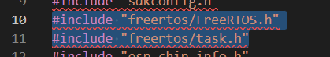
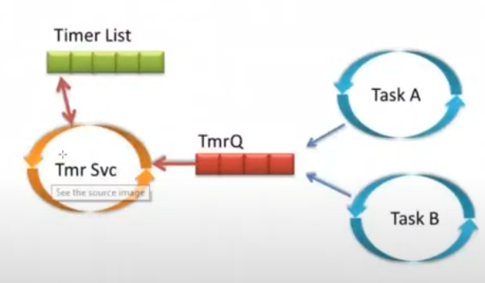
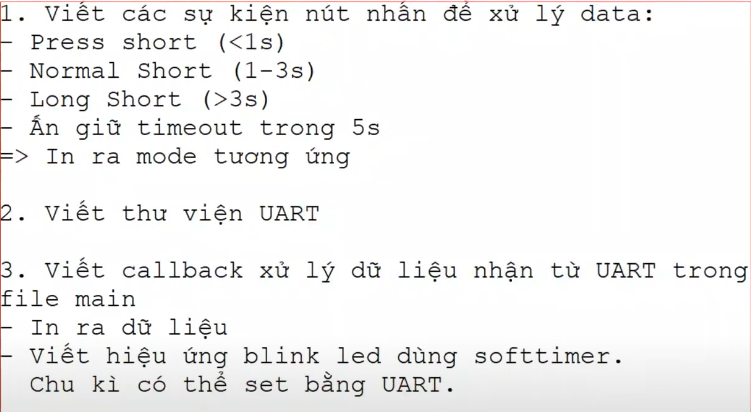

# Free RTOS

> Để sử dụng được Free RTOS thì ta cần phải include 2 thư viện sau:



### Task API:

> - Hiểu đơn giản, task là công việc cần phải xử lý. Trong FreeRTOS, ta có thể coi task giống như thread.
> - Thông qua hàm **xTaskCreat()**, ta có thể tạo ra một task:

```C
BaseType_t xTaskCreate(
                            TaskFunction_t pvTaskCode,
                            const char * const pcName,     /*lint !e971 Unqualified char types are allowed for strings and single characters only. */
                            const uint32_t usStackDepth,
                            void * const pvParameters,
                            UBaseType_t uxPriority,
                            TaskHandle_t * const pxCreatedTask)
```

- pvTaskCode: Tên task (tên hàm) muốn chạy
- \*pcName: Tên do người dùng đặt cho cái task đó
- usStackDepth: size hay còn gọi là Depth của task, kích thước của nó là 4 bytes
- \*pvParameters: một con trỏ dùng để chứa các tham số của task khi task còn hoạt động, thường để NULL
- uxPriority: độ ưu tiên của task này, số càng lớn thì độ ưu tiên càng lớn (từ 0 đến 32)
- \*pxCreatedTask: 1 con trỏ đại diện task, dùng để điều khiển task từ một task khác, ví dụ xóa task này từ một task đang chạy khác

> - Sau khi tạo task, ta gọi hàm **vTaskStartScheduler()** dùng để yêu cầu nhân (Kernel) của RTOS bắt đầu chạy. Ta sẽ xóa task thông qua hàm **xTaskDelete()**

> - NOTE: Trong FreeRTOS, giả sử có nhiều Task. Thì khi một Task rơi vào trạng thái block, thì task có mức ưu tiên cao tiếp theo sẽ được chạy.

> - Khi lập trình với FreeRTOS, ta thường chia ra thành các task, và các task này sẽ không liên quan gì đến nhau cả. Nếu như chúng có liên quan đến nhau thì ta sẽ cần đến các phương pháp liên kết chúng lại như là: Semaphore, Queue, ...

**_Example:_**

```C
#include <stdio.h>
#include <inttypes.h>
#include "sdkconfig.h"
#include "freertos/FreeRTOS.h"
#include "freertos/task.h"
#include "esp_chip_info.h"
#include "esp_flash.h"

/* Task to be created. */
void vTask1(void *pvParameters)
{

    for (;;)
    {
        /* Task code goes here. */
        printf("Task 1\n");
        vTaskDelay(1000 / portTICK_PERIOD_MS);
    }
}

/* Task to be created. */
void vTask2(void *pvParameters)
{

    for (;;)
    {
        /* Task code goes here. */
        printf("Task 2\n");
        vTaskDelay(1000 / portTICK_PERIOD_MS);
    }
}

/* Task to be created. */
void vTask3(void *pvParameters)
{

    for (;;)
    {
        /* Task code goes here. */
        printf("Task 3\n");
        vTaskDelay(1000 / portTICK_PERIOD_MS);
    }
}

void app_main(void)
{

    /* Create the task, storing the handle. */
    xTaskCreate(
        vTask1,   /* Function that implements the task. */
        "Task 1", /* Text name for the task. */
        1024,     /* Stack size in words, not bytes. */
        NULL,     /* Parameter passed into the task. */
        4,        /* Priority at which the task is created. */
        NULL);    /* Used to pass out the created task's handle. */

    /* Create the task, storing the handle. */
    xTaskCreate(
        vTask2,   /* Function that implements the task. */
        "Task 2", /* Text name for the task. */
        1024,     /* Stack size in words, not bytes. */
        NULL,     /* Parameter passed into the task. */
        5,        /* Priority at which the task is created. */
        NULL);    /* Used to pass out the created task's handle. */

    /* Create the task, storing the handle. */
    xTaskCreate(
        vTask3,   /* Function that implements the task. */
        "Task 3", /* Text name for the task. */
        1024,     /* Stack size in words, not bytes. */
        NULL,     /* Parameter passed into the task. */
        6,        /* Priority at which the task is created. */
        NULL);    /* Used to pass out the created task's handle. */
}
```

=> Khi Task 3 rơi vào trạng thái block (đoạn delay) thì task 2 sẽ được thực hiện. Tương tự ...

### Soft Timer (Timer của FreeRTOS):

> - Khi ta không cần đếm quá chính xác, sai số có thể lên đến micro giây hoặc mili giây => Ta sẽ dùng Soft Timer (Timer của FreeRTOS). Vì khi dùng Soft Timer thì chúng ta có thể tạo ra rất nhiều Timer để xử lý. Còn Timer cứng của ESP32 thì nó chỉ có 4 Timer cứng thôi.

> - Software Timer cho phép chúng ta có thể thực thi một tác vụ nào đó trong khoảng thời gian được định trước. Hàm được thực thi bởi Timer sẽ được gọi bởi hàm Timer callback (tương đương với cơ chế ngắt của Timer thông thường).

> - Thời gian giữa lúc Timer Start và callback function của nó được thực thi được gọi là thời gian của Timer (Timer's period)

> - Thêm thư viện: freertos/timers.h



### Event Group

### BÀI TẬP VỀ NHÀ:


