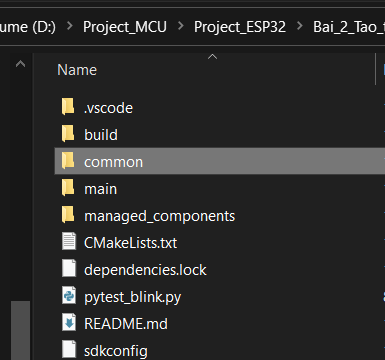
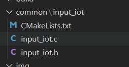
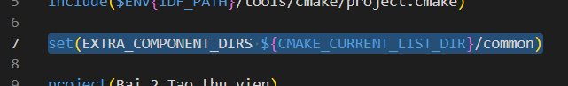

# Hướng dẫn viết thư viện:

> Trong bài này, ta sẽ thử tạo thư viện input và output. Khi bạn muốn tạo thư viện khác, thì trình tự thực hiện cũng y như vậy.
>
> - Trong folder project, ta sẽ tạo ra thêm một folder nữa và đặt tên cho nó là common. Trong folder này sẽ chứa các thư viện của dự án.



## Đầu tiên, ta sẽ viết thư viện Input trước

> - Trong folder common, ta tạo ra một folder chứa thư viện input. Đặt tên là: "input_iot".
> - Bên trong folder này, ta sẽ tạo ra 3 file (Đối với ESP - IDF từ 4.x trở lên) bao gồm file.c, file.h và file CMakeLists.txt. Ở những phiên bản idf cũ hơn, có thể có thêm file component.mk nữa.



> - Để link được đến thư viện, ta sẽ thêm dòng sau vào CMakeLists ở bên ngoài



# Hướng dẫn viết Callback Function

### Khái niệm:

> - Callback Function là một function mà được truyền vào một function khác như một đối số
> - Trong C, để thực thi được Callback Function thì ta sẽ sử dụng Function Pointer.

**Example:**

> Định nghĩa một hàm tính toán mà có 1 số nguyên, và một phép toán. Phép toán lúc này được gọi là một Callback function
> Hàm tính toán này sẽ trả về một kết quả của phép tính dựa trên số nguyên

B1: Khai báo một function pointer ở file.h
B2: Khởi tạo một cái function pointer
B2: Viết hàm callback, tham số truyền vào là một function pointer, kiểu void (kiểu này có thể trả về bất kỳ kiểu dữ liệu nào)
B3: Trong hàm callback, cái function pointer đã khởi tạo ở bước 2 sẽ được gán bằng cái pointer truyền vào

_Triển khai thực hiện code:_

Cú pháp của function pointer:

```C
return_type (*pointer_name)(parameter_types);
```

```C
// Tạo các hàm callback
float cb_square(int num){
  return num*num;
}


// Tạo một function pointer
float calc(int num, float (*op)(int)){
  return op(num);
}

int main(){
   // gọi đến hàm callback
   printf("%.2f\n", calc(5, cb_square));
  return 0;
}
```
